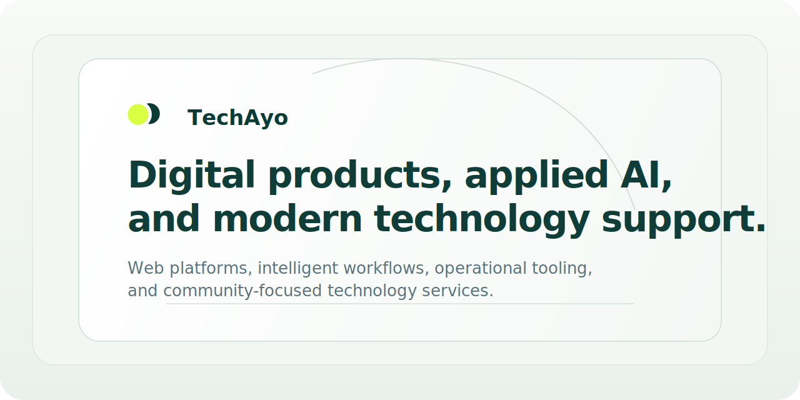

  

   
  <strong>AI-native digital product studio, applied AI lab, and modern support platform for TechAyo.</strong> 
  We build web products, AI workflows, operational systems, and community technology services, while helping teams adopt AI and newer tools with more clarity and less drag.

  
  <strong>techayoDEV</strong>

  
  

## What TechAyo Builds

TechAyo combines four connected capability areas:

- `Digital products and web businesses`: commercial websites, growth funnels, portals, custom platforms, and launch-ready digital services.
- `Applied AI and new technology`: AI R&D, copilots, workflow automation, prototypes, education, and practical enablement for teams adopting newer tools.
- `Modern IT support and operations`: monitoring, support patterns, security hygiene, delivery systems, and operational tooling for growing teams.
- `Community technology support`: structured digital guidance and safeguarding-aware service access for vulnerable residents and public-facing programmes.

## How TechAyo Works

- One team across strategy, design, engineering, AI, support, education, and operations.
- AI-native thinking grounded in real workflows, not hype.
- Commercial delivery shaped around measurable outcomes, maintainability, and ownership.
- Clear boundaries between paid business services, platform operations, and community support programmes.
- Documentation and systems that keep product intent, operations, and maintenance aligned.

## Primary Repository

| Repository | Purpose | Visibility |
| --- | --- | --- |
| [`techayoDEV/techayo`](https://github.com/techayoDEV/techayo) | TechAyo platform codebase, documentation, CI, and presentation assets. | Private |

## Brand

TechAyo uses a calm AI-era visual system: deep green, signal lime, clear typography, and restrained product surfaces. The GitHub profile is intentionally compact so visitors can understand the company shape quickly.

---

Proprietary platform owned and maintained by TechAyo Limited.
