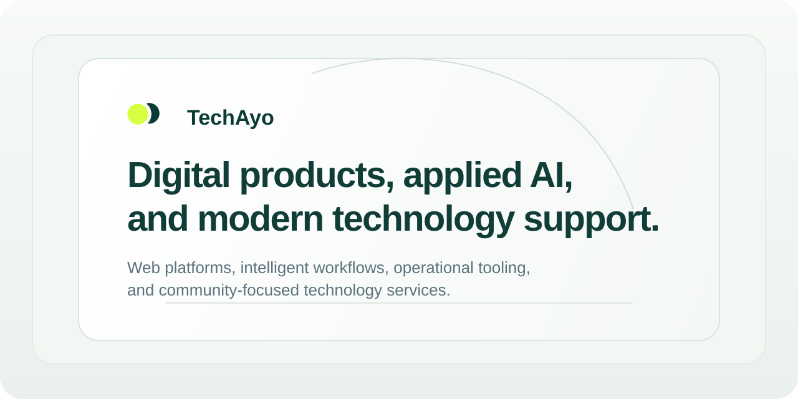

<p align="center">
  
</p>

<p align="center">
  <strong>Digital systems, product infrastructure, and persistent intelligence.</strong><br>
  TechAyo builds and operates digital systems for businesses — from websites and internal operations to AI automation and custom software — supported by technology it develops and maintains itself.
</p>

<p align="center">
  <a href="https://techayo.co.uk"></a>
  <a href="https://github.com/techayoDEV/techayo"></a>
  <a href="https://github.com/techayoDEV/fnlla"></a>
  <a href="https://github.com/techayoDEV/fionn"></a>
</p>

## What TechAyo Is Building

TechAyo is a technology company and product studio building an increasingly connected software ecosystem. The company combines real-world delivery with owned infrastructure so useful engineering can compound across products and customer systems instead of every project becoming an unrelated stack.

A simple view of that ecosystem is:

```text
TechAyo LTD
    |
    +-- FNLLA        application and web infrastructure
    +-- Fionn        persistent intelligence and AI R&D
    +-- TechAyo      company, client and operations platform
    +-- Products     owned vertical software such as Paydeck
    +-- Client systems built and maintained on the same foundations
```

These are separate products with separate ownership, licensing, readiness and support boundaries. The diagram describes the strategic relationship between them; individual repository documentation remains the source of truth for what is implemented today.

## Core Technology

### FNLLA — application infrastructure

[`techayoDEV/fnlla`](https://github.com/techayoDEV/fnlla) is TechAyo's compact open-source PHP framework for server-rendered websites and application surfaces. It provides the maintained application foundation: routing, controllers, views, authentication, authorisation, database work, operational tooling, release workflows and the integrated FNLLA UI runtime.

FNLLA is designed to make business software understandable and maintainable without hidden framework magic, while giving TechAyo and downstream teams a reusable foundation instead of rebuilding the same infrastructure for every delivery.

### Fionn — intelligence infrastructure

[`techayoDEV/fionn`](https://github.com/techayoDEV/fionn) is TechAyo's persistent-personal-intelligence research and product project. Fionn connects memory, context, reasoning, decisions, outcomes and controlled learning while keeping durable system concerns separate from replaceable model packages.

Its long-term product loop is:

```text
Memory -> Understanding -> Reasoning -> Decisions -> Outcomes -> Learning
```

Fionn is not positioned as an AI copy of a user or as a wrapper around a third-party model API. The current foundation deliberately starts small and local: tokenisation, a decoder-only Transformer in PyTorch, training, evaluation, model packaging, governed learning and a browser product shell. The current model remains early-stage research; the wider architecture is designed so intelligence can improve without making one checkpoint the identity of the system.

## Products And Delivery

TechAyo applies the same engineering capability across:

- `Digital products and business systems`: commercial websites, portals, internal operations, custom platforms and launch-ready services.
- `Applied AI and intelligence`: Fionn R&D, AI-assisted workflows, automation, prototypes and practical AI adoption.
- `Owned software products`: vertical products such as Paydeck, where domain workflows become maintained software.
- `Technology operations`: monitoring, security hygiene, deployment, maintenance and operational tooling.
- `Community technology support`: structured digital guidance and safeguarding-aware access for public-facing programmes.

The aim is not simply to own more repositories. It is to let infrastructure, products and real-world delivery reinforce one another while keeping product-specific code, customer ownership and licensing boundaries explicit.

## Operating Model

```text
Infrastructure -> Products -> Real-world use -> Operational learning
       ^                                      |
       +--------------------------------------+
```

A capability solved appropriately at the framework or infrastructure layer can be reused across products. Product and customer work exposes real operational requirements. Those lessons can improve shared technology where they genuinely belong.

This makes TechAyo closer to a technology studio with owned application and intelligence infrastructure than a conventional web agency.

## Primary Repositories

| Repository | Purpose | Visibility |
| --- | --- | --- |
| [`techayoDEV/techayo`](https://github.com/techayoDEV/techayo) | TechAyo public site, client portal, operations platform and application integration layer. | Private |
| [`techayoDEV/fnlla`](https://github.com/techayoDEV/fnlla) | Open-source application and web framework maintained by TechAyo. | Public |
| [`techayoDEV/fionn`](https://github.com/techayoDEV/fionn) | Persistent intelligence architecture, local model R&D, learning system and fionnCHAT product shell. | Project repository |
| [`techayoDEV/paydeck`](https://github.com/techayoDEV/paydeck) | AI-supported payroll product and multi-tenant SaaS platform. | Private |
| [`techayoDEV/.github`](https://github.com/techayoDEV/.github) | GitHub organisation profile and public presentation assets. | Public |

## Positioning

> **TechAyo builds and operates digital systems for businesses — from websites and internal operations to AI automation and custom software — powered by technology it develops and maintains itself.**

Or, more simply:

> **TechAyo turns business operations into software.**

## Contact

- Website: [techayo.co.uk](https://techayo.co.uk)
- Email: [hello@techayo.co.uk](mailto:hello@techayo.co.uk)
- Location: United Kingdom

For a longer explanation of how the projects fit together, see [`docs/TECHAYO-ECOSYSTEM.md`](../docs/TECHAYO-ECOSYSTEM.md).

---

Proprietary and product-source repositories owned and maintained by TechAyo Limited. Open-source components retain the licences stated in their own repositories.
